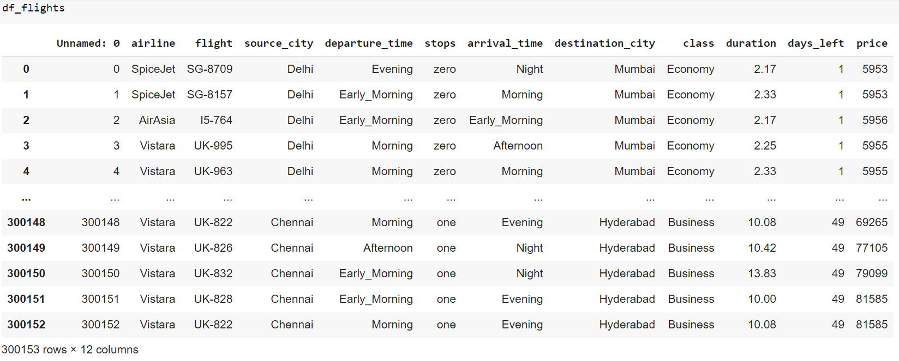

# Flight-Price-Prediction

In this project, we analyzed the flight prices dataset and performed EDA to discover the hidden patterns, important variables, to know how does the flights tickets are priced.

## Introduction:

In today's dynamic travel landscape, predicting flight prices has become an essential aspect for both travelers seeking cost-effective options and airlines aiming to optimize revenue. The myriad of factors influencing ticket costs, such as seasonality, route popularity, day of the week, and class distinctions, makes flight price prediction a challenging yet valuable endeavor.

In this project, the goal is to leverage data analytics and machine learning techniques to build a robust flight price prediction model. The dataset, likely comprising features like departure and arrival cities, dates, airlines, and possibly more, holds the key to unraveling patterns and trends that contribute to the variability in ticket prices.

## Approach:

Data Collection: Acquire a comprehensive dataset containing historical flight information. This dataset should encompass a diverse range of routes, airlines, and temporal variations to ensure the model captures the complexity of the market.

Exploratory Data Analysis (EDA): Conduct EDA to gain insights into the distribution of flight prices, identify correlations between features, and uncover any notable patterns. Visualization tools can aid in understanding the data's underlying structure.

Data Preprocessing: Cleanse and preprocess the data to handle missing values, outliers, and categorical variables. Feature engineering may involve extracting relevant information from timestamps, creating new variables, or encoding categorical data.

Feature Selection: Choose the most influential features for predicting flight prices. This step involves selecting variables that contribute the most to the model's predictive power while minimizing unnecessary complexity.

Model Selection: Experiment with various machine learning algorithms suitable for regression tasks. Algorithms like Random Forests, Gradient Boosting, and Support Vector Machines are commonly employed for predicting numerical values.

Model Training: Split the dataset into training and testing sets to train the selected model. Optimize hyperparameters to enhance the model's performance and ensure its ability to generalize to unseen data.

Evaluation: Evaluate the model's performance using appropriate metrics such as Mean Absolute Error (MAE), Root Mean Squared Error (RMSE), or others. This step helps gauge how well the model predicts flight prices compared to the actual values.

Deployment: Once satisfied with the model's accuracy, deploy it for real-time predictions. Users can input relevant details, and the model will output an estimated flight price based on the learned patterns.

By undertaking this project, we aim to provide a valuable tool for travelers and industry stakeholders, enabling them to make informed decisions regarding flight choices and pricing strategies. Through the integration of data analytics and machine learning, we endeavor to bring efficiency and precision to the realm of flight price prediction.

## Research Questions
The aim of our study is to answer the below research questions:
1. Does price vary with Airlines?
2. How is the price affected when tickets are bought in just 1 or 2 days before departure?
3. Does ticket price change based on the departure time and arrival time?
4. How the price changes with change in Source and Destination?
5. How does the ticket price vary between Economy and Business class?
6. How does the price changes with number of stops in the travel?

## Exploratory Data Analysis

From the above bar chart, we can observe that Indigo airlines has most number of flights with count 704, second highest is Air_india with 218 followed by GO_FIRST, SpiceJet, Vistara, AirAsia with their respective number of flights.

From the above graph, we observe that the price(target) variable is right skewed distributed. For machine learning modelling, we make sure that the target varible is uniformly distributed. We will apply transformations later to it.

Lets dive more into EDA of prices how it varies by different categories

### Does price vary with Airlines?

We can observe from the above boxplot that ticket prices varies from airlines to airlines. As SpiceJet, AirAsia, GO_FIRST, Indigo have the minimal price difference between them and also contains outliers whereas Vistara and Air_India have the highest and second highest ticket price variations respectively. From this graph we conclude that Vistara and Air_India tickets are expensive to travel compared to four other airlines.

### How is the price affected when tickets are bought in just 1 or 2 days before departure?

From the time series line chart, we can say that prices are very high when the flight depature date approaches. This states the prices will be cheaper when booked in advance like 30 days or more prior to travel date and will be higher from 10 days before. We can also see that prices cut down at 1-day before or at the same travel day, it can be due to last minute vacant seats in the flight, so airlines reduce the prices to fillup those seats instead of unfilled.

### How are the prices affected when tickets are bought in just 1 or 2 days before departure for different airlines?

This time for each airlines of the time series line chart, Vistara and Air_India tickets are expensive before days of depature date when compared to rest of the other airlines.

### Does ticket price change based on the departure time and arrival time?

By comparing the boxplots of departure and arrival times, we can observe that the prices for Late_Night times are lowest among the other times. In the Departure times plot, Night time tickets are the highest whereas in arrival times plot, Evening time tickets are highest compared to other times with their respective plots.

### How the price changes with change in Source and Destination?

By comparing the boxplots of Source and Destination cities, we can observe that the prices are almost similar to each other. In both the plots, Kolkata city is a little higher than other cities whereas Delhi city is the lowest. Rest all other cities are having similar or near to same price range.

### How does the ticket price vary between Economy and Business class?

Generally, in any flight there will be more economy class seats than business class seats. So in the above graph, we see that the number of economy class booking options are more than the business class.

It is obvious that business class tickets are more expensive than economy class because of its amenties, extra legroom and comfortable seats, food and beverage services and many more features. So this is the reason business class are expensive.

Vistara and Air_India are the only two airlines, having the both business and economy class whereas the other having only economy class. Comparing the business class category, Vistara tickets are higher than the other.

### How does the price changes with number of stops in the travel?

Most of the flight journeys are having one stop. Second is direct flight journey with zero stops followed by two or more stop in the journey.

As there are more flights with one stop, the price variation is also high for the one stop flights. Whereas two or more stops is the second highest in terms of price and to my surprise, non-stop flights are cheaper.

### Which airline routes are having most number of flights?

From the above table, we can observe that from Delhi to Mumbai is having most number flights with 364, followed by Delhi to Bangalore and Delhi to Kolkata with slightly difference of 310 and 306 respectively. Delhi is the most populas source city having more number of flights.

### What are the top 10 average prices? 

We have taken consideration of both the business and economy class into it and displaying the top 10 average prices from source city to destination city. We see that top are Vistara because of the highly priced business class tickets and outliers, so it resulting into skewness of the mean prices. Interesting point is Kolkate city is appeared 6 times most than other cities. So we consider median as measure of central tendency to elimate it.

### What are the top 10 median prices?

We can observe the change in the ticket prices which is lower than the above table and not a surprise that vistara again dominating the table with 9 entries due to off its business class tickets inclusion as well.

### How is the correlation between the independent and dependent variables?

From the above heatmap, we can observe that the numerical variables 'duration' and 'days_left_before_flight_takeoff' are slightly and negatively correlated to target variable 'price'. It concludes that the target variable price is not highly affected by those two variables.

## Exploratory Data Analysis Summary

After exploring the flight prices dataset, we have discovered hidden patterns, trends, how the variables are effecting the price, how are the independent variables are coorelated to dependent variables. The following are the summary points after analyzing the flights data.

1. Vistara has the most number of booking options available to travel followed by Air_India because these two airlines accomodating both economy and business class tickets for passengers.
2. The most number of flights are owned by Indigo with 704 which is 3 times higher than rest of its competitors.
3. Majority of the ticket prices are in the range of 1500 to 20,000. Some of the ticket prices are exceeding above 30k, 40k to the extreme of 60k, 70k range because of the business class.
4. Vistara and Air_India airlines ticket prices are expensive to travel compare to other airlines.
5. Tickets are booked 30 days prior to travel date are least expensive and the prices start climbing before the 10 days of the journey date.
6. Both the arrival and departure in Night time journey flights are slightly expensive and late nights journey are the cheapest.
7. As mentioned earlier, travelling to or from Kolkate city is expensive than other airline routes.
8. Obviously, the business class tickets are higher than economy class because of its amenties provided by the flight crew to its passengers.
9. One stop flights are the most popular traveling options and has high price variations.
10. The numerical variables are less effective on the target variable Price.

## Future Outcomes
1. Will be exploring more into the data by taking considerations of only economy class tickets in all the airlines.
2. Preprocessing the data by converting the categorical variables into numrical variables.
3. Performing various techniques to handle the outliers asscoaited with.
4. Checking the multi-collinearity of the independent variables.
5. Selecting the prominent features for the Machine Learning modelling.
6. Implement various ML algorithms and calcualting the scores.
7. Comparing the scores and selecting the best performing model.
